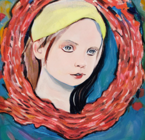

#  インターネットの歴史と性善説の影響: 理想と現実の交差点

この記事を書くために、stable diffusionの環境構築をしました。
肖像権を侵害するような画像がどれほど簡単に生成できるのかを確認するためです。

動作確認のために出力した画像が以下の通りです。

そして2時間後に出力した画像が以下の通りです。

あまりにも…なため、モザイク処理とウォーターマークを施しています。

技術的敷居は、かなり低いことが確認できました。

この事実を踏まえ、以降の記事を読んでくだされば幸いです。

stable diffusionローカル環境構築
https://zenn.dev/ykesamaru/articles/f8038390e58e44

## はじめに

インターネットの原初の設計は、性善説とも言える理想に基づいていました。性善説は、人間は本質的に善であり、悪は社会的な条件や環境によって生じるという哲学的思想です。この考えに基づいて、インターネットの初期の設計者たちは、オープンでアクセス制限の少ないネットワークを構築しました。TCP/IPプロトコルのような基本的な技術は、信頼できる情報交換を保証し、同時にネットワーク内での自由なコミュニケーションを促進することを目指していました。

しかし、このオープンな設計がもたらす未曾有の可能性と同時に、セキュリティの問題やプライバシーの侵害、そして悪意ある行動を助長する環境を作り出すこととなりました。インターネットの進化の歴史は、性善説の理想と現実の厳しい教訓との間に生じる緊張を際立たせています。

## 失敗の事例分析: プライバシー侵害

インターネットの進化は多くの利点をもたらしていますが、同時にプライバシー侵害の問題も引き起こしています。特にソーシャルネットワーキングサービス(SNS)の普及に伴い、個人のプライバシー情報が簡単に公開されるようになりました。SNSプラットフォームは友人や家族とのコミュニケーションを容易にし、新たな人々と繋がる場を提供していますが、一方で、プライバシー設定が不十分であったり、ユーザーが設定を適切に理解していないことが、個人情報の漏洩を招く原因となっています。

例えば、SNSのプライバシー設定は往々にして複雑であり、ユーザーはどの情報が公開されているのかを完全に理解していないことがあります。その結果、故意でなくとも個人の写真や個人情報が広範に共有されてしまうことがあります。さらに、SNSプラットフォーム自体がデータを収集し、マーケティング目的で第三者と共有することも、プライバシー侵害の一因となっています。

また、データ漏洩事件もプライバシー侵害の大きな問題です。企業や組織が保持する大量の顧客データは、セキュリティの欠如により、外部の攻撃者によって盗まれるリスクがあります。近年では、大手企業のデータ漏洩事件が報道され、個人の信用情報や個人識別情報が不正にアクセスされ、悪用される事例が増えています。

これらの問題は、インターネットのオープンな性質と性善説に基づいた設計思想が、現実のセキュリティとプライバシーの問題にどのように対処するかを示す貴重な教訓となっています。プライバシー保護の技術と法律の進歩は、インターネット利用者が安心してオンライン活動を行える環境を作り出すために不可欠です。

## 生成AIと肖像権

近年、生成AIの進歩は目覚ましいものがあります。特にDeepFake技術は、リアルタイムで非常にリアルな動画を生成する能力を持ち、それが社会に多大な影響を与えています。DeepFakeは、元の動画から人物の顔を抽出し、別の人物の顔を合成する技術であり、この技術の進歩により、見分けが非常に難しい偽の動画が簡単に作成できるようになりました。

この技術の進歩は肖像権の問題を引き起こしています。肖像権は、個人が自身の肖像をコントロールする権利であり、無許可での使用や改変を禁止しています。しかし、DeepFake技術により、個人の顔が無許可で別の動画に合成され、そしてその偽の動画がインターネット上で広まる可能性があります。これは特に、政治家やセレブリティなど、公の場に出ることが多い人々にとって大きなリスクとなっています。

例えば、政治家のスピーチを捏造し、偽のメッセージを広める動画が作成され、社会に誤解や混乱をもたらす可能性があります。また、セレブリティの顔を使用して不快なまたは不適切なコンテンツを作成し、その人物の評判やキャリアに悪影響を与えることも考えられます。

肖像権侵害のリスクは、生成AI技術の倫理的かつ法律的な課題を浮き彫りにしています。この問題に対処するには、技術者、法律家、そして政策立案者が連携し、新しい法律や規制を検討し、技術の進歩と個人の権利を適切にバランスさせる必要があります。また、一般の人々も、生成AI技術の可能性とリスクを理解し、適切な対策を講じることが重要となります。

## 日本におけるインターネット初期期間とコミュニティの勃興

インターネットが日本で普及し始めると、さまざまなコミュニティも同時に拡大しました。インターネットは、異なる興味を持つ人々が集まり、共通の話題で交流できるプラットフォームを提供しました。この結果、オンラインコミュニティが形成されました。特にアニメやマンガのファンは、インターネットを利用して情報を交換し、新たな作品を発掘し、そしてその魅力を共有することができました。

オンラインコミュニティの拡充と多様化は、すぐに大きくなりました。あめぞうや後発の2ちゃんねる、そして後にはSNSや動画共有サイトなど、多くのオンラインプラットフォームがコミュニティの発展を支えました。実況、2次創作の発表、新しいソフトウェアの提供などが行われ、コミュニティはより広範で多様なものとなりました。

1997年に設立されたドワンゴは動画サービス「niconico」を運営するようになり、派生したサービスを通じて、コミュニティ内のクリエイティブな交流が活性化させました。
2007年に設立され、14年間で4000万人以上のユーザーを獲得したピクシブは、創作コミュニティにとって重要なプラットフォームとなりました。アーティストやファンが交流し、新しい作品を発表し、評価し合う場となっています。

Dwango, Pixiv, Unity, More Form Industry Group for 3D Avatars
https://www.animenewsnetwork.com/news/2019-01-02/dwango-pixiv-unity-more-form-industry-group-for-3d-avatars/.141553#:~:text=Dwango%2C%20Pixiv%2C%20Unity%2C%20More%20Form,to%20standardize%20avatar%20file%20format

## コミュニティによる自主規制

これらのプラットフォームは、コミュニティの自主規制とユーザー間の交流を促進することで、創作活動の拡充とコミュニティの健全な成長を支えています。しかし、技術の進歩とともに、これらのプラットフォームでもハメを外した例や悪用の可能性が生じた例が多数存在することも無視できません。そのため、これらのプラットフォームは、技術と倫理のバランスを保ちながら、コミュニティの健全な成長と創造性の促進を図っています。（いわゆる投稿削除や垢BANなど）

インターネットの普及とコミュニティの勃興は相互に影響し合いながら、日本のサブカルチャーがどのように進化し、国際的に広がっていったかを示しています。これは、テクノロジーと文化がどのように連動して進化するかの貴重な例となっています。

新しい技術の登場は常に社会に多大なる影響を与え、時には利便性や効率向上をもたらしますが、一方で新たな問題や課題も生じることがあります。特にインターネットやSNSの普及に伴い、人々のコミュニケーションの方法が大きく変わりました。しかし、これらの技術の進歩は、個人や社会に対する悪意ある行動の新たな手段を提供することとなりました。

Winnyは2002年に故金子勇さんによって開発されたP2P技術を利用したファイル共有ソフトウェアであり、革新的アルゴリズムを用いていました。
しかし、Winnyの技術は著作権を無視してコピーされたファイルの送受信など、深刻な被害を引き起こす原因となりました。これにより、暴露ウイルスと呼ばれるコンピューターウイルスの媒介やそれに伴う個人情報や機密情報の流出、児童ポルノの流通、そして大量のデータ交換に伴うネットワークの混雑などの社会問題に発展しました。この問題は安倍晋三内閣官房長官（当時）が使用中止を呼びかけるまでに至り、金子自身も京都府警に著作権法違反の容疑で逮捕されるという事態にまで発展しました。

https://ja.wikipedia.org/wiki/Winny

このような背景から、Winnyの技術は社会から拒絶される結果となりました。特に、Winny技術の悪用は技術自体の可能性や利点を見えにくくし、技術の発展や普及を妨げる要因となりました。また、Winnyの悪用は他のP2P技術やインターネット技術全般に対する信頼を損なう結果となり、新たな技術開発や採用に対する慎重な態度をもたらしました。

興味深いことに、大手掲示板などでは、個人情報の流出に関しての自主規制が自然発生的に形成されていました。これは、新しく生じた技術およびそのコミュニティが、自らのテリトリーを守るために行った、防衛本能的行動と言えます。

これらの問題に直面して、多くのコミュニティやグループは、自らのテリトリーを守るために自主的な警備やコンテンツの自主的な規制を行っています。コミックマーケットにおける自主的な警備は、その良い例であり、これらのコミュニティが自らの文化やテリトリーを荒らされたくないという強い意向を示しています。新技術とそれに根付いた文化を構成する人々が、自らのテリトリーを守ることは、これらの新たな問題や課題に対処する一つの方法であり、それによってコミュニティ内外の人々との良好な関係を築く基盤を作ることができます。

## 肖像権の問題

肖像権の問題は、デジタル技術が進化する中で注目されているテーマの一つです。特に、ローカル環境にstable diffusionという技術を導入することで、どれほど簡単に肖像権を侵害しうる画像を生成できるのかを実際に試してみました。結果、非専門家である私でも、短時間のうちに高品質な画像を生成することができました。具体的には、最初の画像が0時間で完成したのに対し、次の画像はわずか2時間後に完成しました。この実験を通じて、現代の技術がいかに進んでいるのか、そしてそれによってどれほどのリスクが生じているのかを痛感しました。技術の進化は驚異的ですが、それに伴う倫理的な課題や法的な問題にも目を向ける必要があります。私の経験をもとに、この問題についての認識を深め、適切な対処方法を模索することが求められます。

